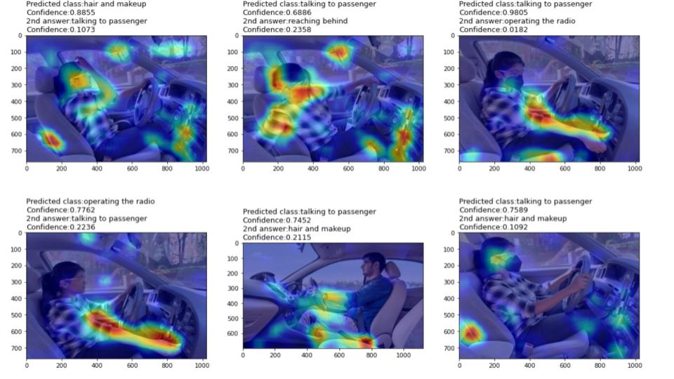

# Distracted Driver Detection 

The main objective of the project is to detect driver distractions using images which can be scaled into 4 wheeler dash cams and alert the drivers on go. It would help prevent several accidents on roads. The idea of the project was from a journal 'Distracted driver detection by combining in-vehicle and image data using deep learning' by Furkan Omerustaoglu, C. Okan Sakar and Gorkem Kar [(link)](https://www.sciencedirect.com/science/article/pii/S1568494620305950?via%3Dihub). The paper combined image data and vehicle data i.e., fuel consumption, torque etc to detect distracted drivers. We focused on image dataset and model optimization solely since neither the vehicle data nor the code is available publicly. We used VGG-16 and inception V3 models mentioned in the paper and along with used Resnet50 and AlexNet models to test the efficiency of these models against each other. The code also includes grad cam visualizations of randomly selected test data images along with ground truth labels and top 2 predictions. We measured the models efficiency using several metrics such as accuracy, precision, recall, f1-scores per class, top 2 accuracy. Resnet50 had the highest accuracy with almost 91%.

## Dataset
The image dataset is publicly available for training on Kaggle: https://www.kaggle.com/competitions/state-farm-distracted-driver-detection

As the test dataset labels are not publicly available, we used 10% of the train dataset for testing. To partition the dataset, we tried randomly shuffling the dataset and picking equal proportions of images from the 10 classes used. But to measure the models performance more accurately, we decided to completely remove the images corresponding to two drivers from the training and use for testing (corresponding code can be found in ‘DataProcessing.ipynb’). The train(folder: 'train') and test dataset(folder: 'TestData','TestData2') along with ‘driver_imgs_list.csv’ can be found on the link below. 

Datasets: https://drive.google.com/drive/folders/1aF0ROvRmQAhEhrbpSO7Kgm-hkRSIWJp_?usp=sharing

## Running the scripts:
 
1) The github link is private but has been shared with ‘wdqin@bu.edu’ email. 
Please download all the jupyter notebooks from this github link provided in the ‘523FinalProject/Code’ path. 

2) The shared drive 'Data' has been shared with the email: ‘wdqin@bu.edu’ as well as the link has been provided and made public to BU emails. 
Link - https://drive.google.com/drive/folders/1aF0ROvRmQAhEhrbpSO7Kgm-hkRSIWJp_?usp=sharing

	a. Right-click on the shared 'Data' folder. 
	b. Click Add shortcut to Drive. 
	c. Select 'My Drive'. 
	d. Click Add shortcut. 
	e. Update the variable containing the file path. F.E: if the shortcut has been added to the path ‘/content/MyDrive’, variable(f.e: ‘filepath') must be assigned the value ‘/content/MyDrive/Data/’. Details of variable are provided under each file below

Note: The shared drive needs to be added as a shortcut to the 'My Drive' folder, otherwise the files will not be able to run. 

3) Run .ipynb files
 

#### Run DataProcessing.ipynb
The main purpose of this file is to extract the images from train.zip and split it into train and test datasets based on individual drivers. 
Note: Would create duplicate folders which are already shared via link as part of the dataset. Also, manual intervention might be required incase of folder creation(comments added in the .ipynb file)

	a. But if required, please open google colab using https://research.google.com/colaboratory/ link. Then upload the DataProcessing.ipynb notebook using the Upload tab. 
	b. Variable ‘filepath’ declared in the notebook needs to be modified to point to the location where the shortcut to ‘Data’ folder has been added, including the Data. F.E: if the shortcut has been added to the path ‘/content/MyDrive’, ‘filepath’ variable must be assigned the value ‘/content/MyDrive/Data/’ 
	c. Make sure ‘Data’ folder consists of ‘train.zip’ and ‘driver_imgs_list.csv’ files 
	d. Then click on Runtime>Run All. Please confirm the Google drive access during the run of the notebook. 

#### Model Training and Testing

Note 1: The code saves .pth files of the trained models after every epoch or every two epochs. Execution might fail if there is not enough space to save the models on drive. Can you please make sure there enough space on drive before running the .ipynb files. 

Note 2: The 'Models' folder also contain our saved models with best performance which are used to make predictions on test data. These can be used to load and perform testing on the test datasets from the .ipynb notebooks

#### Run ResNet.ipynb 

	a. Please open google colab using https://research.google.com/colaboratory/ link.
	b. Then upload the ResNet.ipynb notebook using the Upload tab.
	c. Update the variable ‘shared_filepath’ with the location containing the Data folder shared. (refer to 2 & 3 for details on how to add the shared folder and modify the path)
	d. Then click on Runtime>Run All. Please confirm the Google drive access during the run of the notebook.

#### Run InceptionV3(2).ipynb (Keras Implementation)

	a. Please open google colab using https://research.google.com/colaboratory/ link. 
	b. Then upload the InceptionV3(2).ipynb notebook using the Upload tab.
	c. Please confirm the Google drive access during the run of the notebook.
	d. Update the variable ‘filepath’ with the location containing the Data folder shared. (refer to 2 & 3 for details on how to add the shared folder and modify the path)
	f. A sample neural net already trained by us is also uploaded on the drive.
	g. Comments are added for each code cell describing what each code cell does.

#### Run InceptionV3_Pytorch.ipynb 

	a. Please open google colab using https://research.google.com/colaboratory/ link. 
	b. Then upload the InceptionV3_Pytorch.ipynb notebook using the Upload tab.
	c. Update the variable ‘shared_filepath’ with the location containing the Data folder shared. (refer to 2 & 3 for details on how to add the shared folder and modify the path)
	d. Then click on Runtime>Run All. Please confirm the Google drive access during the run of the notebook.

#### Run AlexNet.ipynb
	a. Please open google colab using https://research.google.com/colaboratory/ link.
	b. Then upload the AlexNet.ipynb notebook using the Upload tab.
	c. Update the variable ‘filepath’ with the location containing the Data folder shared. (refer to 2 & 3 for details on how to add the shared folder and modify the path)
	d. Then click on Runtime>Run All. Please confirm the Google drive access during the run of the notebook.

#### Run VGG16.ipynb
        
	a.  Please open google colab using https://research.google.com/colaboratory/ link.
	b. Then upload the VGG16.ipynb notebook using the Upload tab.
	c. Update the variable ‘filepath’ with the location containing the Data folder shared. (refer to 2 & 3 for details on how to add the shared folder and modify the path)
	d. Then click on Runtime>Run All. Please confirm the Google drive access during the run of the notebook.

## Project Implementation

	1. Reproduced the results for VGG16 and Inception V3(both pytorch and keras) model mentioned in the paper (No code was provided)
	2. Implemented the design with AlexNet and Resnet50 to test the efficiency of the models
	3. Implemented GradCam to identify the salient feature from the last layer
	4. Test the model on extra set of images collected off internet and personal pictures for scenarios like driving a car for steering is on the right side as opposed to the current dataset where all the cars have left side steering, drivers wearing a mask, mirror reflection of the images etc.,

## Project Presentation Slides

The link for the slides is: https://docs.google.com/presentation/d/1LruERVS5c2OVvzKaNsaNw-50KAxRS856BeeN8OtRv1U/edit?usp=sharing 

## Experiment Results

#### Resnet50:

Prediction of classes on random test images

 
 

GradCam Visualizations of test images

 
 

Prediction of classes on new set of test images

 
 

GradCam Visualizations of new set of test images

## References
* https://www.sciencedirect.com/science/article/pii/S1568494620305950?via%3Dihub
* https://github.com/jacobgil/pytorch-grad-cam
* https://ai.plainenglish.io/distracted-driver-detection-using-machine-and-deep-learning-techniques-1ba7e7ce0225
* https://openaccess.thecvf.com/content_cvpr_2018_workshops/papers/w14/Baheti_Detection_of_Distracted_CVPR_2018_paper.pdf
* https://dl.acm.org/doi/10.1145/3154448.3154452
* https://ietresearch.onlinelibrary.wiley.com/doi/10.1049/iet-its.2018.5392
* https://arxiv.org/pdf/1409.1556.pdf
* https://papers.nips.cc/paper/2012/file/c399862d3b9d6b76c8436e924a68c45b-Paper.pdf
* https://arxiv.org/pdf/1512.03385.pdf
* https://arxiv.org/pdf/1512.00567.pdf
* https://papers.nips.cc/paper/2019/file/bdbca288fee7f92f2bfa9f7012727740-Paper.pdf
* https://www.researchgate.net/publication/353438370_Keras_and_TensorFlow_A_Hands-On_Experience
* https://blog.paperspace.com/writing-resnet-from-scratch-in-pytorch/
